# Voxa — Complete User Flow Document

> **App:** AI-Powered Voice Mock Interview Coach  
> **Stack:** React 19 + FastAPI + Supabase + Razorpay + Vapi + Clerk Auth

---

## Table of Contents

1. [Architecture Overview](#1-architecture-overview)
2. [Authentication Flow](#2-authentication-flow)
3. [Landing Page Flow](#3-landing-page-flow)
4. [Interview Flow](#4-interview-flow)
5. [Dashboard Flow](#5-dashboard-flow)
6. [Subscription & Payment Flow](#6-subscription--payment-flow)
7. [Profile & Settings Flow](#7-profile--settings-flow)
8. [Plan Limit Enforcement](#8-plan-limit-enforcement)
9. [Security & Code Quality](#9-security--code-quality)
10. [API Endpoint Map](#10-api-endpoint-map)
11. [Database Schema](#11-database-schema)

---

## 1. Architecture Overview

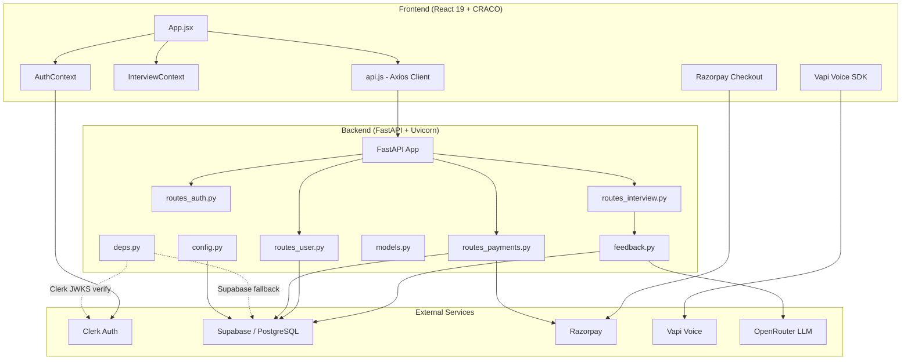

---

## 2. Authentication Flow

### 2.1 Sign Up

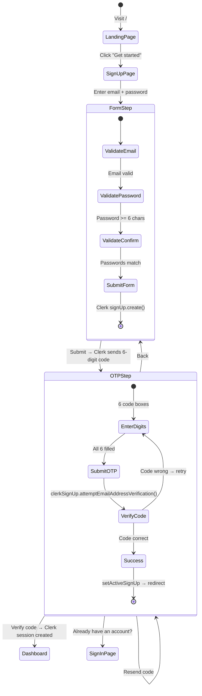

**Steps:**
1. User navigates to `/signup`
2. Enters **email** (validated format), **password** (min 6 chars), **confirm password** (must match)
3. Clicks "Create Account" → Clerk sends a 6-digit email verification code
4. OTP step: 6 individual digit inputs (auto-focus next after each digit)
5. Clicks "Verify code" → Clerk confirms OTP and creates session
6. Redirected to `/dashboard`

### 2.2 Sign In

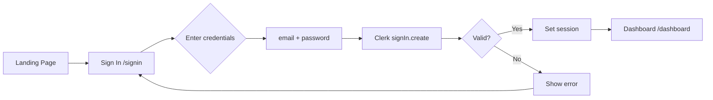

**Steps:**
1. User navigates to `/signin`
2. Enters email + password (with show/hide toggle)
3. Clerk validates credentials via `signIn.create()`
4. On success → redirect to `/dashboard`
5. On failure → inline error message

### 2.3 Password Reset

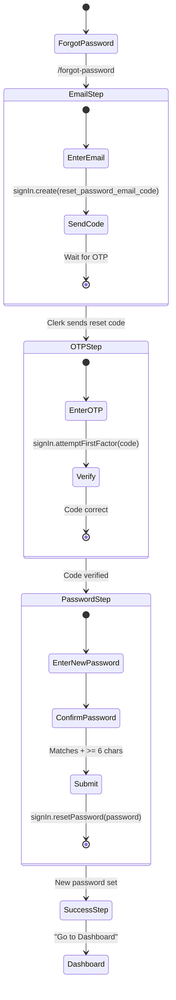

**Steps:**
1. User navigates to `/forgot-password`
2. **Email step:** Enter email → Clerk sends 6-digit reset code
3. **OTP step:** Enter code → verify via `attemptFirstFactor`
4. **Password step:** Enter new password (min 6) + confirm
5. **Success screen:** "Password updated" with link to Dashboard

### 2.4 Auth Context & Token Management

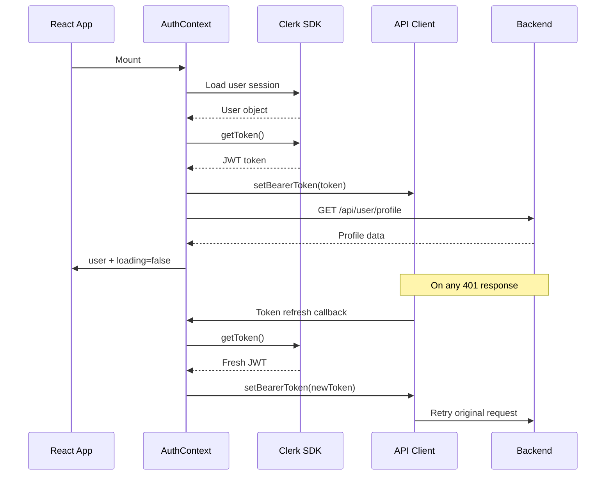

**Key behaviors:**
- Auth state is persisted via Clerk session cookies
- On mount: loads Clerk user, fetches JWT, sets up axios interceptor
- Token refresher: automatically retries failed 401 requests with a fresh token
- Sign out: clears Clerk session, removes bearer token, navigates to `/`
- Profile fetch failure is logged but gracefully falls back to Clerk user data

### 2.5 Backend Token Verification

Backend `deps.py` verifies tokens in this order:

1. **Clerk JWT verification** using `PyJWT` library via Clerk's JWKS endpoint (`{CLERK_JWT_ISSUER}/.well-known/jwks.json`). Verifies RS256 signature and issuer claim. Returns user `id`, `email`, `name` from the JWT claims.
2. **Supabase fallback** — `supabase.auth.get_user()` for Supabase-issued tokens.
3. If both fail → HTTP 401.

The old raw JWT payload decode bypass (`_extract_from_jwt_payload`) has been removed — unverified tokens are rejected.

---

## 3. Landing Page Flow

```mermaid
graph TB
    subgraph Landing["/ — LandingPage"]
        NAV[Nav Bar] --> HERO[Hero Section]
        HERO --> SOCIAL[Social Proof Strip]
        SOCIAL --> FEATURES[Features Bento Grid]
        FEATURES --> HOW[How It Works]
        HOW --> PREVIEW[Sample Report Preview]
        PREVIEW --> TESTIMONIALS[Testimonials]
        TESTIMONIALS --> PRICING[Pricing Section]
        PRICING --> FAQ[FAQ Accordion]
        FAQ --> CTA[Final Call-to-Action]
        CTA --> FOOTER[Footer]
    end

    HERO --> |"Get Started"| SIGNIN[/signin]
    HERO --> |"See Sample"| PREVIEW
    PRICING --> |"Free"| SIGNIN
    PRICING --> |"Starter/Pro Subscribe"| RAZORPAY[Razorpay Checkout]
    CTA --> |"Start"| SIGNIN
    CTA --> |"See Pricing"| PRICING
    NAV --> |"Dashboard"| DASHBOARD[/dashboard]
    NAV --> |"New Interview"| SETUP[/setup]
```

**Sections:**

| # | Section | Content | CTA |
|---|---|---|---|
| 1 | **Nav** | Logo, nav links (Features, How it works, Pricing, FAQ), sign in/dashboard link | "Get started" → `/signin` or "New Interview" → `/setup` |
| 2 | **Hero** | Animated headline, subtitle, VoicePreview widget (simulated live interview) | "Start mock interview" → `/signin` or `/setup` |
| 3 | **Social Proof** | Marquee of company logos (Google, Figma, Slack, etc.) | — |
| 4 | **Features** | 5 bento-grid cards (Voice-first, Follow-ups, Rubric, Q-by-Q, Any role) | — |
| 5 | **How It Works** | 3 steps: Configure → Speak → Get scored | "Try it now" → `/setup` |
| 6 | **Sample Report** | Mock report (score 88, skills, strengths, improvements) | — |
| 7 | **Testimonials** | 3 user quotes with star ratings | — |
| 8 | **Pricing** | 3 plan cards with feature lists | Free → `/signin`, Paid → Razorpay |
| 9 | **FAQ** | 7 accordion items | — |
| 10 | **Final CTA** | "Your next interview is closer than you think" | "Start free interview" → `/setup` |
| 11 | **Footer** | Logo, links, copyright | — |

---

## 4. Interview Flow

### 4.1 Setup → Live Interview → Report

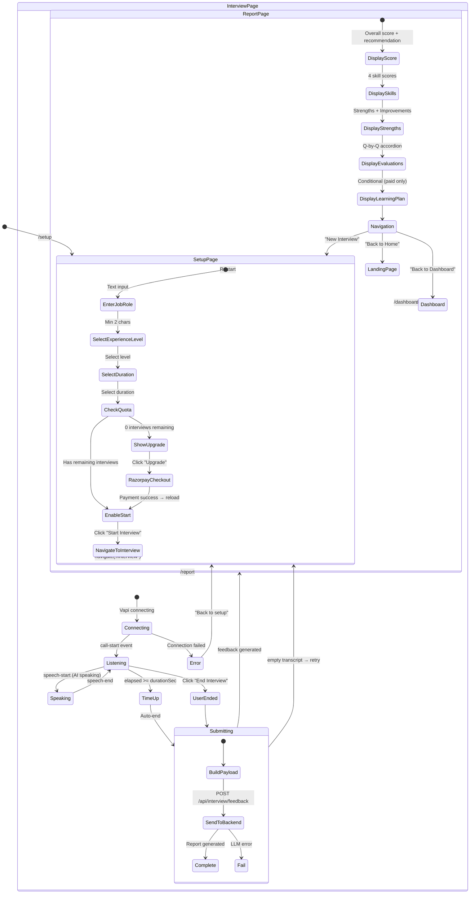

### 4.2 Setup Page Detail

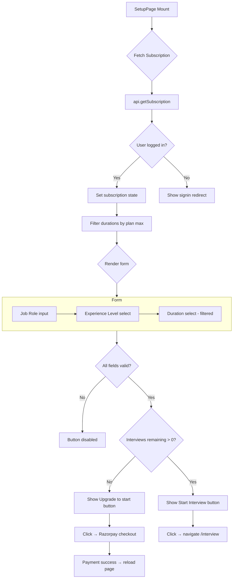

**Duration options by plan:**
- **Free:** 5, 10, 15 min
- **Starter:** 5, 10, 15 min
- **Pro:** 5, 10, 15, 20, 30 min

### 4.3 Live Interview Detail

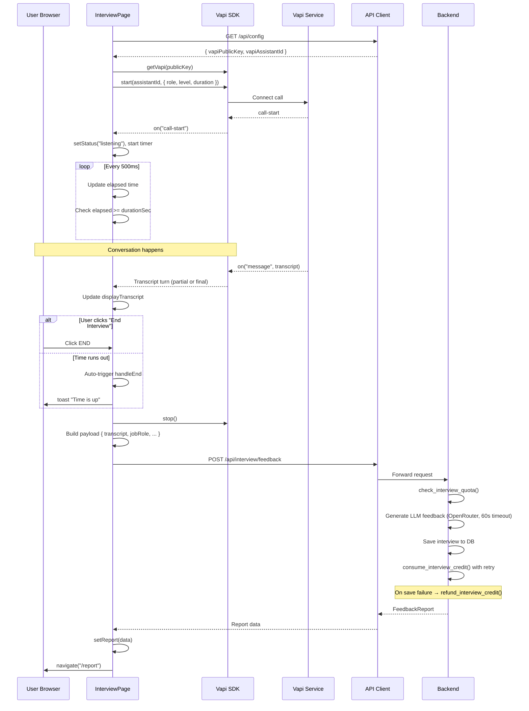

### 4.4 Feedback Generation (Backend)

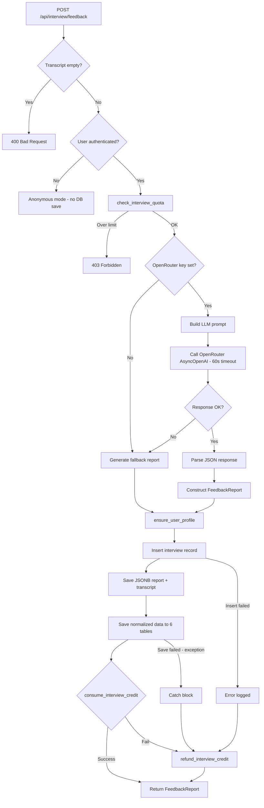

**Normalized tables written:**
1. `transcript_turns` — each user/assistant turn as a row
2. `skill_scores` — technical, communication, problem_solving, confidence
3. `question_evaluations` — per-question score + feedback
4. `interview_strengths` — identified strengths
5. `interview_improvements` — areas to improve
6. `learning_suggestions` — personalized learning plan items

---

## 5. Dashboard Flow

```mermaid
graph TB
    subgraph Dashboard["/dashboard"]
        LOAD[Load Data] --> PROFILE[api.getProfile]
        LOAD --> STATS[api.getDashboardStats]
        LOAD --> INTERVIEWS[api.getInterviews]
        LOAD --> SUB[api.getSubscription]

        PROFILE --> HERO[Welcome Hero Card]
        SUB --> GOAL[Weekly Goal Card]
        SUB --> PLAN[Subscription Plan Banner]
        STATS --> STATS_GRID[Stats Grid - 4 cards]
        STATS --> CHARTS[Analytics Section]
        STATS --> PROGRESS[Progress Cards - 3 cols]
        INTERVIEWS --> HISTORY[Interview History]
    end

    HERO --> |"Start new interview"| SETUP
    HERO --> |Disabled if 0 remaining| SETUP_DISABLED

    PLAN --> |Free user| UPGRADE_STARTER[Upgrade to Starter]
    PLAN --> |Free user| UPGRADE_PRO[Upgrade to Pro]
    PLAN --> |Starter user| UPGRADE_PRO2[Upgrade to Pro]
    PLAN --> |Pro user| STATUS[On Pro plan]

    UPGRADE_STARTER --> RAZORPAY
    UPGRADE_PRO --> RAZORPAY
    UPGRADE_PRO2 --> RAZORPAY

    HISTORY --> SEARCH[Search bar]
    HISTORY --> FILTER[Level filter]
    HISTORY --> LIST[Card grid]
    LIST --> |Click card| REPORT[/report/:id]

    LOAD -->|hasData=false| EMPTY[Empty state]
    EMPTY --> HERO

    FEEDBACK[Feedback Section] --> FEEDBACK_PAGE[/feedback]
```

### Dashboard Sections Visual Layout

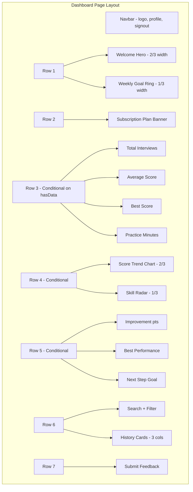

### Subscription Banner Detail

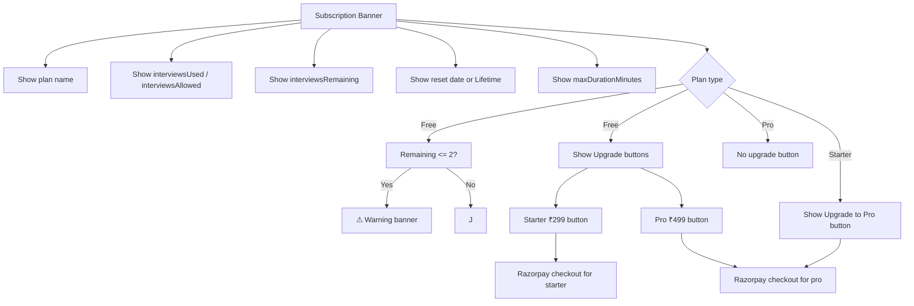

---

## 6. Subscription & Payment Flow

### 6.1 Plan Comparison

| Feature | Free | Starter (₹299/mo) | Pro (₹499/mo) |
|---|---|---|---|
| **Interviews** | 2 total (lifetime) | 10 per month | 20 per month |
| **Max duration** | 15 min | 15 min | 30 min |
| **Reset** | Never | Monthly billing cycle | Monthly billing cycle |
| **Analytics** | ❌ | ✅ | ✅ |
| **Learning Plan** | ❌ | ✅ | ✅ |
| **Priority features** | ❌ | ❌ | ✅ |
| **Price** | ₹0 | ₹299/mo | ₹499/mo |

### 6.2 Payment Flow

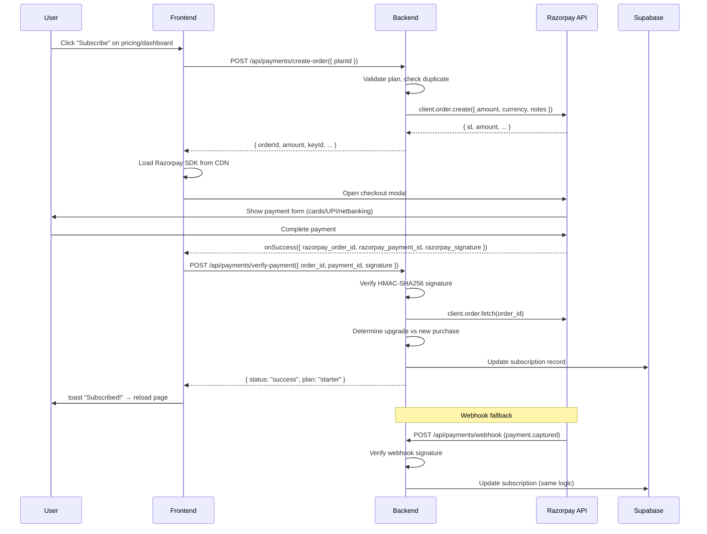

### 6.3 Upgrade vs New Purchase Logic

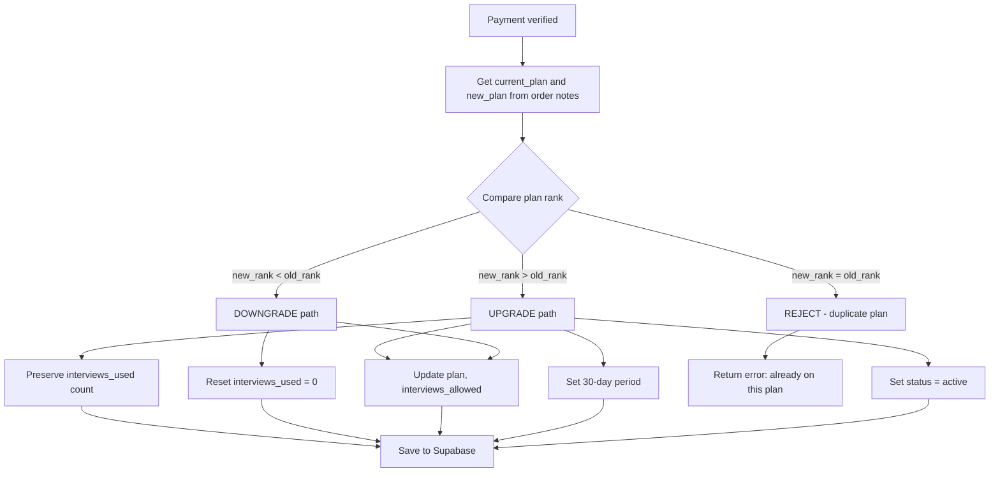

### 6.4 Period Reset Logic

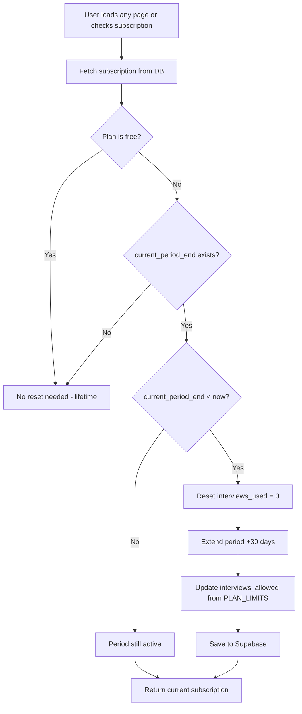

---

## 7. Profile & Settings Flow

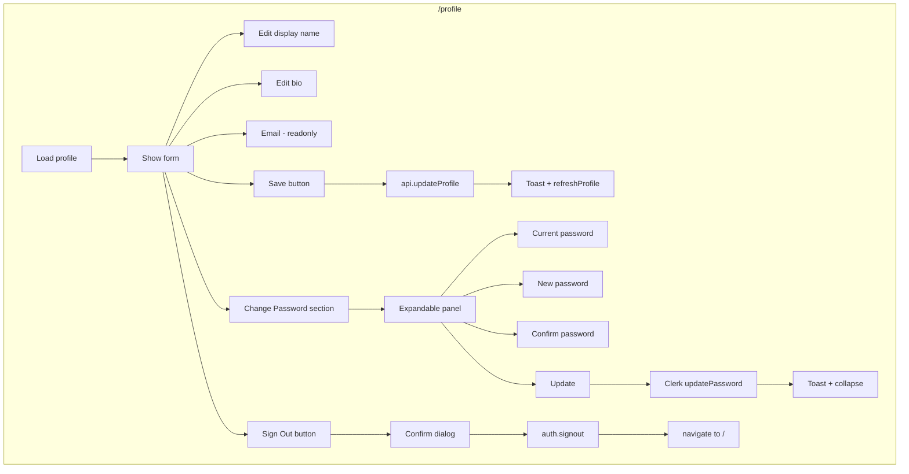

---

## 8. Plan Limit Enforcement

### 8.1 Enforcement Points Map

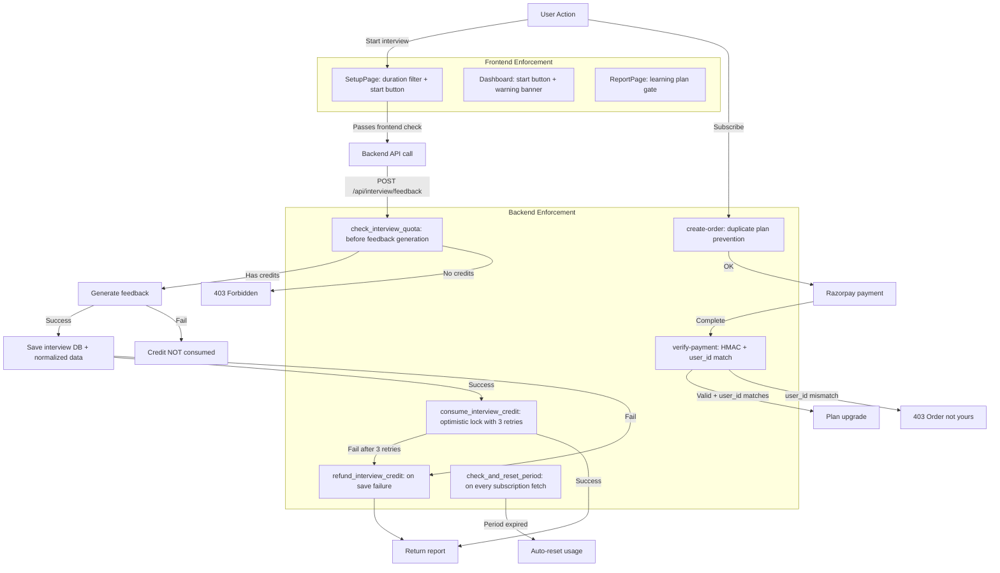

### 8.2 Enforcement Details

| # | Layer | Location | Check | On Violation |
|---|---|---|---|---|---|
| 1 | Frontend | `SetupPage.jsx` | `interviewsRemaining <= 0` | Button disabled, shows "Upgrade to start" |
| 2 | Frontend | `SetupPage.jsx` | Duration > `maxDurationMinutes` | Option hidden from dropdown |
| 3 | Frontend | `DashboardPage.jsx` | `interviewsRemaining <= 0` | "Start new interview" disabled |
| 4 | Frontend | `DashboardPage.jsx` | `interviewsRemaining <= 2` | Warning banner in subscription card |
| 5 | Frontend | `ReportPage.jsx` | `hasLearningPlan === false` | Learning plan hidden, shows upgrade CTA |
| 6 | Backend | `feedback.py:299-305` | `check_interview_quota()` before saving | HTTP 403, interview not saved |
| 7 | Backend | `routes_user.py:373-387` | `consume_interview_credit()` optimistic lock (eq + 3 retries) | Graceful failure → `refund_interview_credit()` |
| 8 | Backend | `routes_user.py:390-401` | `refund_interview_credit()` on save/credit failure | Decrement atomic counter |
| 9 | Backend | `routes_payments.py:80-82` | `notes.user_id == current_user.id` in `verify_payment()` | HTTP 403 "Order does not belong to this user" |
| 10 | Backend | `routes_payments.py:44-47` | Duplicate plan in `create_order()` | HTTP 400 "already on this plan" |
| 11 | Backend | `routes_payments.py:78-80` | HMAC signature in `verify_payment()` | HTTP 400 "Invalid signature" |
| 12 | Backend | `routes_user.py:310-336` | `check_and_reset_period()` on every subscription fetch | Auto-zero usage, extend period |

---

## 9. Security & Code Quality

### 9.1 Secrets Management
- `.env` contains **placeholder values only** — actual secrets are set via deployment environment variables
- The committed `.env` has all API keys redacted (`sk-or-v1-your-openrouter-api-key`, `your-supabase-service-role-key`, etc.)
- `.gitignore` must exclude `.env` from version control

### 9.2 Authentication Security

| Fix | Affected File | Description |
|---|---|---|
| **JWT signature verification** | `deps.py` | Clerk tokens verified against JWKS endpoint (`RS256`, issuer check). Raw JWT decode bypass (`_extract_from_jwt_payload`) removed — unverified payloads no longer accepted. |
| **Password validation** | `models.py` | `SignUpRequest.password` validated via Pydantic `field_validator` (min 6 chars). |
| **Sign-out scoping** | `routes_auth.py` | Uses `supabase.auth.sign_out()` (current session only) instead of `admin.sign_out()` (all sessions). |

### 9.3 Race Conditions

| Fix | Affected File | Description |
|---|---|---|
| **Atomic credit consumption** | `routes_user.py` | `consume_interview_credit()` uses optimistic concurrency: reads current `interviews_used`, updates with `.eq("interviews_used", current_used)` so concurrent requests don't silently overwrite. 3 retry attempts. |
| **Credit refund on failure** | `feedback.py` | If the database save fails at any point after credit is consumed, `refund_interview_credit()` is called to decrement the counter. Refund called in: save failure path, normalized data failure, and general `except` block. |

### 9.4 Input Validation & Error Handling

| Fix | Affected File | Description |
|---|---|---|
| **Payment user_id check** | `routes_payments.py` | `verify_payment()` now checks that `notes.user_id` (from Razorpay order) matches `current_user.id`. |
| **CORS restriction** | `app.py` | When `CORS_ORIGINS=*`, credentials are disabled (`allow_credentials=False`). Explicit origin lists keep credentials enabled. |
| **Profile fetch silent error** | `AuthContext.jsx` | Profile fetch failure in `AuthProvider` is now logged via `console.error` before falling back to Clerk user data. |
| **Supabase exception logging** | `routes_user.py` | `get_user_id_candidates()` now logs the exception instead of silently swallowing it. |
| **OpenRouter timeout** | `feedback.py` | `AsyncOpenAI` client configured with `timeout=60.0` to prevent hanging on LLM calls. |

### 9.5 Dead & Redundant Code Removed

| Fix | Affected File | Description |
|---|---|---|
| `_extract_from_jwt_payload` | `deps.py` | Removed — was a security hole (unverified JWT decode). |
| `_decode_jwt_payload` | `deps.py` | Removed — only used by the above. |
| `extract_user_email_from_claims` | `deps.py` | Removed — only used by the above. |
| `PlanInfo` model class | `models.py` | Removed — defined but never referenced anywhere. |
| `PLAN_RANK` duplication | `routes_user.py`, `routes_payments.py` | Moved to shared `models.py` module. |
| Module-level `_cachedConfig` | `InterviewPage.jsx` | Replaced with `useRef` — was shared across user sessions. |
| Redundant loading condition | `DashboardPage.jsx` | Simplified `authLoading || (!user && !authLoading)` to just `authLoading`. |
| Unreachable password-match check | `SignUpPage.jsx` | Removed — already validated by the `isValid` guard above. |

### 9.6 Deprecation Fixes

| Fix | Affected File | Description |
|---|---|---|
| `datetime.utcnow()` → `datetime.now(timezone.utc)` | `routes_user.py` | Replaced deprecated naive datetime with timezone-aware UTC. |
| Emoji in production string | `DashboardPage.jsx` | `"Goal hit! 🎯"` → `"Goal hit!"`. |
| Error handler `preventDefault()` | `ErrorBoundary.jsx` | Only calls `event.preventDefault()` in development mode — production errors propagate to console. |

---

## 10. API Endpoint Map

### Public Endpoints

| Method | Path | Authentication | Purpose |
|---|---|---|---|
| `GET` | `/api/` | None | API health check |
| `GET` | `/api/config` | None | Get Vapi config (public key + assistant ID) |
| `GET` | `/api/payments/config` | None | Get Razorpay key ID |
| `POST` | `/api/auth/signup` | None | Create account via Supabase Auth |
| `POST` | `/api/auth/signin` | None | Sign in via Supabase Auth |
| `POST` | `/api/auth/reset-password` | None | Send password reset email |
| `POST` | `/api/auth/refresh` | None | Refresh auth session token |

### Auth-Required Endpoints

| Method | Path | Purpose | Security Notes |
|---|---|---|---|
| `POST` | `/api/auth/signout` | Sign out (current session only) | Uses `sign_out()`, not admin API |
| `POST` | `/api/auth/update-password` | Update password after reset | |
| `GET` | `/api/user/profile` | Get user profile | Auto-creates profile on first access |
| `PUT` | `/api/user/profile` | Update display name, bio, avatar | |
| `GET` | `/api/user/interviews` | List interviews (paginated) | |
| `GET` | `/api/user/interviews/{id}` | Get interview detail + report | |
| `GET` | `/api/user/dashboard-stats` | Get dashboard statistics | |
| `GET` | `/api/user/subscription` | Get subscription details | |
| `GET` | `/api/user/subscription/usage` | Quick usage check | |
| `POST` | `/api/user/feedback` | Submit tool feedback | Calls `ensure_user_profile` first (FK fix) |
| `GET` | `/api/interview/plan-config` | Get plan-specific config | |
| `POST` | `/api/interview/validate-setup` | Validate interview setup against plan | |
| `POST` | `/api/interview/feedback` | Submit transcript, get feedback report | Atomic credit consumption + refund path |
| `POST` | `/api/payments/create-order` | Create Razorpay order | Prevents duplicate plan purchase |
| `POST` | `/api/payments/verify-payment` | Verify Razorpay payment | HMAC + `user_id` in notes checked |
| `POST` | `/api/payments/webhook` | Razorpay webhook receiver | HMAC webhook signature verified |

---

## 11. Database Schema

### Entity Relationship

```mermaid
erDiagram
    user_profiles ||--o{ interviews : "has"
    user_profiles ||--o{ feedback_entries : "submits"
    user_profiles ||--|| user_subscriptions : "has"

    interviews ||--o{ transcript_turns : "contains"
    interviews ||--o{ skill_scores : "has"
    interviews ||--o{ question_evaluations : "has"
    interviews ||--o{ interview_strengths : "has"
    interviews ||--o{ interview_improvements : "has"
    interviews ||--o{ learning_suggestions : "has"

    user_profiles {
        uuid id PK
        uuid user_id UK "Clerk user ID"
        text email
        text display_name
        text avatar_url
        text bio
        timestamptz created_at
        timestamptz updated_at
    }

    user_subscriptions {
        uuid id PK
        uuid user_id UK FK
        text plan "free|starter|pro"
        int interviews_allowed
        int interviews_used
        text status "active|past_due|cancelled"
        timestamptz current_period_start
        timestamptz current_period_end
        text razorpay_order_id
        text razorpay_payment_id
        timestamptz created_at
        timestamptz updated_at
    }

    interviews {
        uuid id PK
        uuid user_id FK
        text job_role
        text experience_level
        int duration_minutes
        int overall_score
        text final_recommendation
        text summary
        jsonb report
        jsonb transcript
        timestamptz created_at
    }

    transcript_turns {
        uuid id PK
        uuid interview_id FK
        text role "user|assistant"
        text text
        int timestamp
    }

    skill_scores {
        uuid id PK
        uuid interview_id FK
        int technical
        int communication
        int problem_solving
        int confidence
    }

    question_evaluations {
        uuid id PK
        uuid interview_id FK
        text question
        text answer_summary
        int score
        text feedback
    }

    interview_strengths {
        uuid id PK
        uuid interview_id FK
        text text
    }

    interview_improvements {
        uuid id PK
        uuid interview_id FK
        text text
    }

    learning_suggestions {
        uuid id PK
        uuid interview_id FK
        text text
    }

    feedback_entries {
        uuid id PK
        uuid user_id FK
        text email
        text feedback
        int rating
        text category
        timestamptz created_at
    }
```

### Row-Level Security

All tables have RLS enabled with policies restricting access to user's own data via `auth.uid()` matching:

- `user_profiles`: `user_id = auth.uid()`
- `user_subscriptions`: `user_id = auth.uid()`
- `interviews`: `user_id = auth.uid()`
- `transcript_turns`: via `interview_id IN (SELECT id FROM interviews WHERE user_id = auth.uid())`
- Same pattern for `skill_scores`, `question_evaluations`, `interview_strengths`, `interview_improvements`, `learning_suggestions`
- `feedback_entries`: `user_id = auth.uid()`

---

## 12. End-to-End User Journey Summary

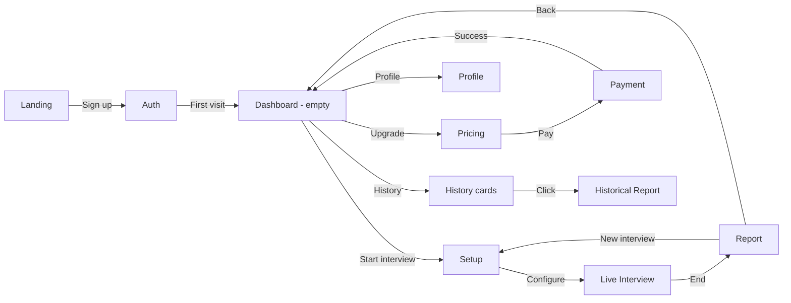

**Complete 10-step journey:**

1. **Land** at `/` → see hero, features, pricing
2. **Sign up** at `/signup` → email verification with OTP
3. **Dashboard** at `/dashboard` → empty state, "Start new interview"
4. **Setup** at `/setup` → pick role, level, duration (filtered by plan)
5. **Interview** at `/interview` → Vapi voice call with Aria, live transcript, timer
6. **Report** at `/report` → score, skills, strengths, Q-by-Q evaluation
7. **Dashboard** → stats updated, interview history populated
8. **Upgrade** → click "Starter ₹299" → Razorpay payment → plan activated
9. **Repeat** → longer durations, learning plan unlocked, analytics visible
10. **Manage** → edit profile, change password, submit feedback
